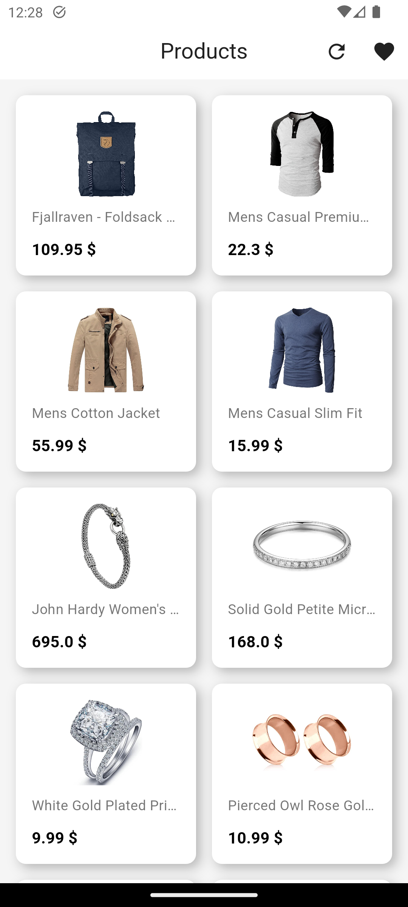
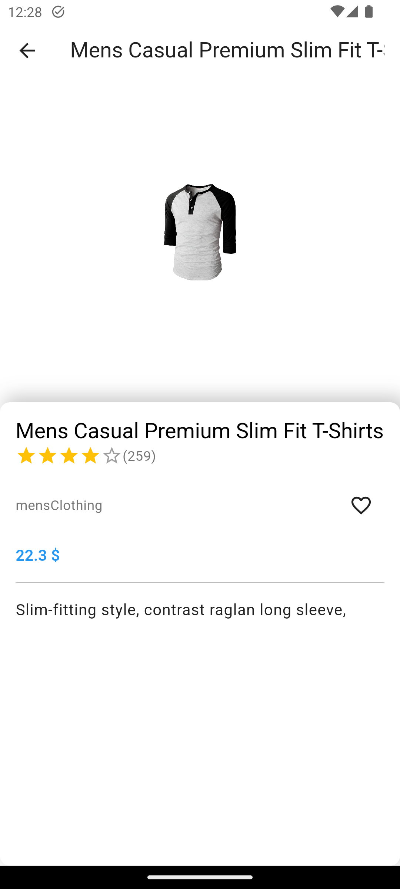

# task_app

A new Flutter project.

## Getting Started

This project is a starting point for a Flutter application that follows the
[simple app state management
tutorial](https://flutter.dev/to/state-management-sample).

For help getting started with Flutter development, view the
[online documentation](https://docs.flutter.dev), which offers tutorials,
samples, guidance on mobile development, and a full API reference.

## Assets

The `assets` directory houses images, fonts, and any other files you want to
include with your application.

The `assets/images` directory contains [resolution-aware
images](https://flutter.dev/to/resolution-aware-images).

## Localization

This project generates localized messages based on arb files found in
the `lib/src/localization` directory.

To support additional languages, please visit the tutorial on
[Internationalizing Flutter apps](https://flutter.dev/to/internationalization).

## Implemented Features

- **Details**: Handles detailed information display.
- **Favorites**: Manages favorite items.
- **Home**: Main entry point or dashboard.
- **Products**: Manages product-related functionalities.
- **Splash**: Displays splash screen at startup.
- **Theme Switcher**: A button in the home screen allows users to toggle between dark and light mode for a personalized user experience.

## Used Packages

- `cupertino_icons`: ^1.0.2
- `easy_localization`: ^3.0.7
- `get`: ^4.6.6
- `animate_do`: ^3.1.2
- `flutter_bounceable`: ^1.1.0
- `equatable`: ^2.0.5
- `dartz`: ^0.10.1
- `flutter_bloc`: ^8.1.3
- `bloc`: ^8.1.2
- `dio`: ^5.8.0+1
- `hive`: ^2.2.3
- `hive_flutter`: ^1.1.0
- `cached_network_image`: ^3.3.0
- `custom_rating_bar`: ^3.0.0

## Screenshots

Here are some screenshots of the application:

## Building the App

To build the app, follow these steps:

1. Ensure you have the Flutter SDK installed. You can download it from the [official Flutter website](https://flutter.dev/docs/get-started/install).
2. Navigate to the project directory.
3. Run `flutter pub get` to install dependencies.
4. Use `flutter run` to launch the app on an emulator or connected device.

## Flutter SDK Requirements

This project requires the following Flutter SDK versions:

- Flutter SDK: >=2.0.0 <3.0.0
- Dart SDK: >=2.12.0 <3.0.0

Ensure your environment meets these requirements before building the app.
